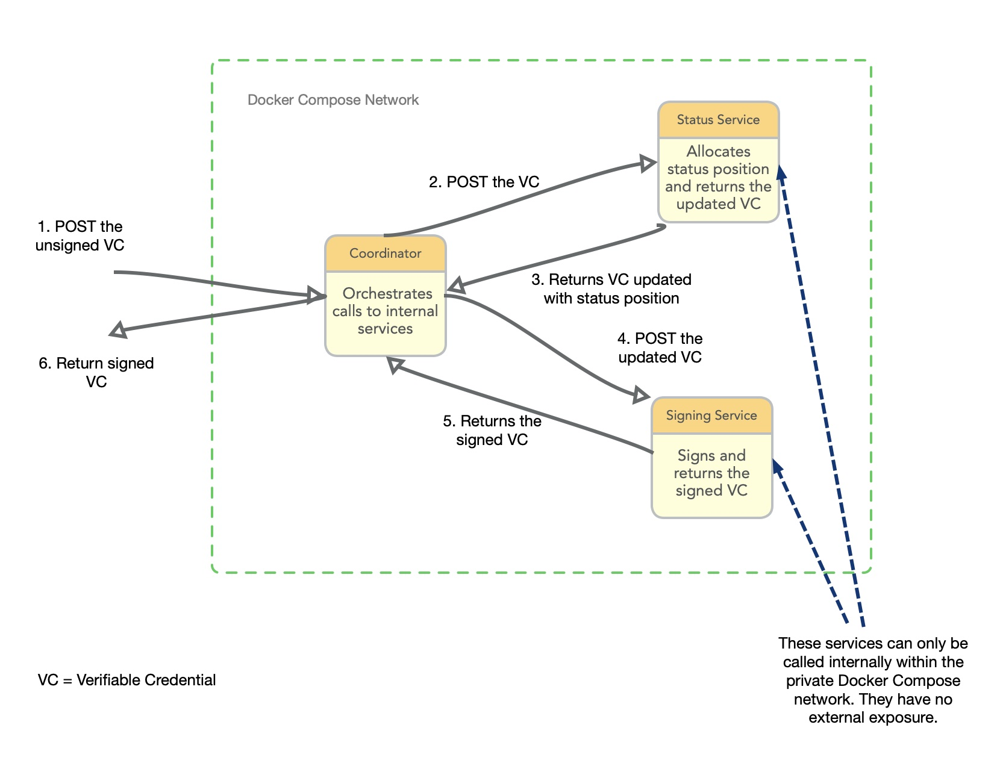

# Digital Credentials Consortium Verifiable Credentials Issuer

[](https://github.com/digitalcredentials/issuer-coordinator/actions?query=workflow%3A%22Node.js+CI%22)

An express app that signs Verifiable Credentials. The app coordinates calls to a signing service and a status service, each themselves running as express apps, with all three apps running together within Docker Compose.



Try it in five minutes or less with our [Quick Start](#quick-start).

Note that you needn't clone this repository to use the issuer - you can simply run the provided docker-compose file, which pulls pre-built images from Docker Hub. 

## Table of Contents

- [Summary](#summary)
- [Quick Start](#quick-start)
- [Configuration](#configuration)
  - [Generate a New Key](#generate-a-new-key)
  - [Tenants](#tenants)
    - [Add a Tenant](#add-a-tenant)
      - [.coordinator.env](#coordinatorenv)
      - [.signing-service.env](#signing-serviceenv)
    - [Use a Tenant](#use-a-tenant)
  - [Revocation and Suspension](#revocation-and-suspension)
  - [Environment Variables](#environment-variables)
  - [DID Registries](#did-registries)
- [Usage](#usage)
  - [Issuing](#issuing)
  - [Revoking and Suspending](#revoking-and-suspending)
- [Learner Credential Wallet](#learner-credential-wallet)
- [Development](#development)
  - [Installation](#installation)
  - [Testing](#testing)
- [Contribute](#contribute)
- [License](#license)

## Summary

Use this service to issue [Verifiable Credentials](https://www.w3.org/TR/vc-data-model-2.0/) with a [status](https://www.w3.org/TR/vc-bitstring-status-list/) that can later be updated to revoke or suspend the credential.

Implements two [VC-API](https://w3c-ccg.github.io/vc-api/) HTTP endpoints:

 * [POST /credentials/issue](https://w3c-ccg.github.io/vc-api/#issue-credential)
 * [POST /credentials/status](https://w3c-ccg.github.io/vc-api/#update-status)

We've tried hard to make this simple to install and maintain, and correspondingly easy to evaluate and understand as you consider whether digital credentials are useful for your project, and whether this issuer would work for you. 

In particular, we've separated the discrete parts of an issuer into smaller self-contained apps that are consequently easier to understand and evaluate, and easier to *wire* together to compose functionality. The apps are wired together in a simple Docker Compose network that pulls images from Docker Hub.

We've made installation a gradual process starting with a simple version that can be up and running in about five minutes, and then progressing with configuration as needed.

## Quick Start

These four steps should take less than five minutes in total:

### Install Docker

Docker has made this straightforward, with [installers for Windows, Mac, and Linux](https://docs.docker.com/engine/install/) that make it as easy to install Docker as any other application.

### Make a Docker Compose file

Create a file called `docker-compose.yml` and add the following:

```yaml
version: '3.5'
services:
  coordinator:
    image: digitalcredentials/issuer-coordinator:0.2.0
    ports:
      - "4005:4005"
  signer:
    image: digitalcredentials/signing-service:0.3.0
```

### Run it

From the terminal in the same directory that contains your `docker-compose.yml` file, run:

```bash
docker compose up
```

### Issue

Issue cryptographically signed credentials by posting unsigned Verifiable Credentials to the issue endpoint, which signs the credential and returns it. Try out your test issuer with this cURL command, which you simply paste into the terminal:

```bash
curl --location 'http://localhost:4005/instance/test/credentials/issue' \
--header 'Content-Type: application/json' \
--data-raw '{
  "@context": [
    "https://www.w3.org/ns/credentials/v2",
    "https://purl.imsglobal.org/spec/ob/v3p0/context-3.0.2.json"
  ],
  "id": "urn:uuid:2fe53dc9-b2ec-4939-9b2c-0d00f6663b6c",
  "type": [
    "VerifiableCredential",
    "OpenBadgeCredential"
  ],
  "name": "DCC Test Credential",
  "issuer": {
    "type": [
      "Profile"
    ],
    "id": "did:key:z6MkhVTX9BF3NGYX6cc7jWpbNnR7cAjH8LUffabZP8Qu4ysC",
    "name": "Digital Credentials Consortium Test Issuer",
    "url": "https://dcconsortium.org",
    "image": "https://user-images.githubusercontent.com/752326/230469660-8f80d264-eccf-4edd-8e50-ea634d407778.png"
  },
  "validFrom": "2023-08-02T17:43:32.903Z",
  "credentialSubject": {
    "type": [
      "AchievementSubject"
    ],
    "achievement": {
      "id": "urn:uuid:bd6d9316-f7ae-4073-a1e5-2f7f5bd22922",
      "type": [
        "Achievement"
      ],
      "achievementType": "Diploma",
      "name": "Badge",
      "description": "This is a sample credential issued by the Digital Credentials Consortium to demonstrate the functionality of Verifiable Credentials for wallets and verifiers.",
      "criteria": {
        "type": "Criteria",
        "narrative": "This credential was issued to a student that demonstrated proficiency in the Python programming language that occurred from **February 17, 2023** to **June 12, 2023**."
      },
      "image": {
        "id": "https://user-images.githubusercontent.com/752326/214947713-15826a3a-b5ac-4fba-8d4a-884b60cb7157.png",
        "type": "Image"
      }
    },
    "name": "Jane Doe"
  }
}'
```

This should return a fully formed and signed credential printed to the terminal, that should look something like this (it will be all smushed up, but you can format it in something like [JSONLint](https://jsonlint.com)):

```json
{
    "@context": [
        "https://www.w3.org/ns/credentials/v2",
        "https://purl.imsglobal.org/spec/ob/v3p0/context-3.0.2.json",
        "https://w3id.org/security/suites/ed25519-2020/v1"
    ],
    "id": "urn:uuid:2fe53dc9-b2ec-4939-9b2c-0d00f6663b6c",
    "type": [
        "VerifiableCredential",
        "OpenBadgeCredential"
    ],
    "name": "DCC Test Credential",
    "issuer": {
        "type": [
            "Profile"
        ],
        "id": "did:key:z6MknNQD1WHLGGraFi6zcbGevuAgkVfdyCdtZnQTGWVVvR5Q",
        "name": "Digital Credentials Consortium Test Issuer",
        "url": "https://dcconsortium.org",
        "image": "https://user-images.githubusercontent.com/752326/230469660-8f80d264-eccf-4edd-8e50-ea634d407778.png"
    },
    "validFrom": "2023-08-02T17:43:32.903Z",
    "credentialSubject": {
        "type": [
            "AchievementSubject"
        ],
        "achievement": {
            "id": "urn:uuid:bd6d9316-f7ae-4073-a1e5-2f7f5bd22922",
            "type": [
                "Achievement"
            ],
            "achievementType": "Diploma",
            "name": "Badge",
            "description": "This is a sample credential issued by the Digital Credentials Consortium to demonstrate the functionality of Verifiable Credentials for wallets and verifiers.",
            "criteria": {
                "type": "Criteria",
                "narrative": "This credential was issued to a student that demonstrated proficiency in the Python programming language that occurred from **February 17, 2023** to **June 12, 2023**."
            },
            "image": {
                "id": "https://user-images.githubusercontent.com/752326/214947713-15826a3a-b5ac-4fba-8d4a-884b60cb7157.png",
                "type": "Image"
            }
        },
        "name": "Jane Doe"
    },
    "proof": {
        "type": "Ed25519Signature2020",
        "created": "2023-10-05T11:17:41Z",
        "verificationMethod": "did:key:z6MknNQD1WHLGGraFi6zcbGevuAgkVfdyCdtZnQTGWVVvR5Q#z6MknNQD1WHLGGraFi6zcbGevuAgkVfdyCdtZnQTGWVVvR5Q",
        "proofPurpose": "assertionMethod",
        "proofValue": "z5fk6gq9upyZvcFvJdRdeL5KmvHr69jxEkyDEd2HyQdyhk9VnDEonNSmrfLAcLEDT9j4gGdCG24WHhojVHPbRsNER"
    }
}
```

WARNING: DO NOT USE THIS TO ISSUE `REAL` CREDENTIALS UNTIL YOU'VE [SET YOUR OWN SIGNING KEY](#generate-a-new-key)

NOTE: cURL can get a bit clunky if you want to experiment, so you might consider trying [Postman](https://www.postman.com/downloads/) which makes it very easy to construct and send HTTP calls.

NOTE: Status updates are not enabled in the Quick Start. You've got to setup a couple of things to [enable revocation and suspension](#enable-revocation-and-suspension).

Great - you've issued a cryptographically signed credential. Now you'll want to configure the application to issue credentials signed with your own private key (the credential you just issued was signed with a test key that is freely shared so can't be used in production).

## Versioning

The `issuer-coordinator` and the services it coordinates are all intended to run as Docker images within a Docker Compose network. For convenience, we've published those images to Docker Hub so that you don't have to build them locally yourself from the GitHub repositories.

The images on Docker Hub will of course be updated to add new functionality and fix bugs. Rather than overwrite the default (`latest`) version on Docker Hub for each update, we've adopted the [Semantic Versioning Guidelines](https://semver.org) with our Docker image tags.

We DO NOT provide a `latest` tag so you must provide a tag name (i.e, the version number) for the images in your Docker Compose file, as we've done [here](docker-compose.yml).

To ensure you've got compatible versions of the services and the coordinator, the `major` number for each should match. At the time of writing, the versions for each are at `0.2.0`, and the `major` number (the leftmost number) agrees across all three.

If you do ever want to work from the source code in the repository and build your own images, we've tagged the commits in GitHub that were used to build the corresponding Docker image. So a GitHub tag of `v0.1.0` coresponds to a Docker image tag of `0.1.0`.

## Configuration

There are a few things you'll want to configure. These include, but may not be limited to:
* Your signing keys, which enable only you to sign your credentials
* Revocation/suspension support
* "Multi-tenant" signing, which enables you to use different keys for different credentialing purposes (e.g., signing credentials for different courses)

The app is configured with three .env files:

* [.coordinator.env](.coordinator.env)
* [.signing-service.env](.signing-service.env)
* [.status-service.env](.status-service.env)

If you've used the Quick Start `docker-compose.yml`, then you'll have to change it a bit to point at these files. Alternatively, we've pre-configured this [docker-compose.yml](docker-compose.yml), though, so you can just use that.

The issuer is pre-configured with a preset signing key for testing that can only be used for testing and evaluation. Any credentials signed with this key are meaningless because anyone else can use it to sign credentials, and so could create fake copies of your credentials which would appear to be properly signed. There would be no way to know that it was fake. So, you'll want to add our own key which you do by generating a new key and setting it for a new tenant name.

### Generate a new key

To issue your own credentials, you must generate your own signing key and keep it private. At the moment, the issuer supports two [DID](https://www.w3.org/TR/did-core/) key formats/protocols: `did:key` and `did:web`.

The `did:key` DID is one of the simpler DID implementations and doesn't require that the DID document be hosted anywhere. However, many organizations are likely to prefer the `did:web` DID for production deployments. This DID format and protocol allows the owner to rotate (change) their signing key without having to update every credential that is signed by the old keys.

We've tried to simplify key generation by providing convenience endpoints in the issuer that you can use to generate a brand new key. You can generate a DID key with these cURL commands (in a terminal):

- `did:key`:
  ```bash
  curl --location 'http://localhost:4005/did-key-generator'
  ```
- `did:web`:
  ```bash
  curl \
    --location 'localhost:4006/did-web-generator' \
    --header 'Content-Type: application/json' \
    --data-raw '{
      "url": "https://raw.githubusercontent.com/user-or-org/did-web-test/main"
    }'
  ```

These commands will return a JSON document that contains the following data:

- a secret seed
- the corresponding DID
- the corresponding DID Document

Here is an example output for `did:key`:

```json
{
	"seed": "z1AjQUBZCNoiyPUC8zbbF29gLdZtHRqT6yPdFGtqJa5VfQ6",
	"did": "did:key:z6MkweTn1XVAiFfHjiH48oLknjNqRs43ayzguc8G8VbEAVm4",
	"didDocument": {
		"@context": ["https://www.w3.org/ns/did/v1", "https://w3id.org/security/suites/ed25519-2020/v1", "https://w3id.org/security/suites/x25519-2020/v1"],
		"id": "did:key:z6MkweTn1XVAiFfHjiH48oLknjNqRs43ayzguc8G8VbEAVm4",
		"verificationMethod": [{
			"id": "did:key:z6MkweTn1XVAiFfHjiH48oLknjNqRs43ayzguc8G8VbEAVm4#z6MkweTn1XVAiFfHjiH48oLknjNqRs43ayzguc8G8VbEAVm4",
			"type": "Ed25519VerificationKey2020",
			"controller": "did:key:z6MkweTn1XVAiFfHjiH48oLknjNqRs43ayzguc8G8VbEAVm4",
			"publicKeyMultibase": "z6MkweTn1XVAiFfHjiH48oLknjNqRs43ayzguc8G8VbEAVm4"
		}],
		"authentication": ["did:key:z6MkweTn1XVAiFfHjiH48oLknjNqRs43ayzguc8G8VbEAVm4#z6MkweTn1XVAiFfHjiH48oLknjNqRs43ayzguc8G8VbEAVm4"],
		"assertionMethod": ["did:key:z6MkweTn1XVAiFfHjiH48oLknjNqRs43ayzguc8G8VbEAVm4#z6MkweTn1XVAiFfHjiH48oLknjNqRs43ayzguc8G8VbEAVm4"],
		"capabilityDelegation": ["did:key:z6MkweTn1XVAiFfHjiH48oLknjNqRs43ayzguc8G8VbEAVm4#z6MkweTn1XVAiFfHjiH48oLknjNqRs43ayzguc8G8VbEAVm4"],
		"capabilityInvocation": ["did:key:z6MkweTn1XVAiFfHjiH48oLknjNqRs43ayzguc8G8VbEAVm4#z6MkweTn1XVAiFfHjiH48oLknjNqRs43ayzguc8G8VbEAVm4"],
		"keyAgreement": [{
			"id": "did:key:z6MkweTn1XVAiFfHjiH48oLknjNqRs43ayzguc8G8VbEAVm4#z6LSnYW9e4Q4EXTvdjDhKyr2D1ghBfSLa5dJGBfzjG6hyPEt",
			"type": "X25519KeyAgreementKey2020",
			"controller": "did:key:z6MkweTn1XVAiFfHjiH48oLknjNqRs43ayzguc8G8VbEAVm4",
			"publicKeyMultibase": "z6LSnYW9e4Q4EXTvdjDhKyr2D1ghBfSLa5dJGBfzjG6hyPEt"
		}]
	}
}
```

...and here is an example output for `did:web` \*:

```json
{
    "seed": "z1AcNXDnko1P6QMiZ3bxsraNvVtRbpXKeE8GNLDXjBJ5UHz",
    "decodedSeed": {...},
    "did": "did:web:raw.githubusercontent.com:user-or-org:did-web-test:main",
    "didDocument": {
        "@context": [
            "https://www.w3.org/ns/did/v1",
            "https://w3id.org/security/suites/ed25519-2020/v1",
            "https://w3id.org/security/suites/x25519-2020/v1"
        ],
        "id": "did:web:raw.githubusercontent.com:user-or-org:did-web-test:main",
        "assertionMethod": [
            {
                "id": "did:web:raw.githubusercontent.com:user-or-org:did-web-test:main#z6MkfGZKFTyxiH9HgFUHbPQigEWh8PtFaRkESt9oQLiTvhVq",
                "type": "Ed25519VerificationKey2020",
                "controller": "did:web:raw.githubusercontent.com:user-or-org:did-web-test:main",
                "publicKeyMultibase": "z6MkfGZKFTyxiH9HgFUHbPQigEWh8PtFaRkESt9oQLiTvhVq"
            }
        ]
    }
}
```

**\* Note:** For the `did:web` key, the value of `didDocument` needs to be hosted at `${DID_WEB_URL}/.well-known/did.json`, where `DID_WEB_URL` is the issuer controlled URL that was passed as the `url` field of the request body in the `did:web` cURL command above. In the example above, this URL is https://raw.githubusercontent.com/user-or-org/did-web-test/main, because we are using GitHub to host a DID document in a repo named `did-web-test`, owned by user/org `user-or-org`, at the path `/.well-known/did.json`. In a production deployment, this might be something like https://registrar.example.edu.

Now that you've got your key, you'll want to enable it by adding a new tenant to use the seed.

### Tenants

You might want to allow more than one signing key/DID to be used with the issuer. For example, you might want to sign university/college degree diplomas with a DID that is only used by the registrar, but also allow certificates for individual courses to be signed by different DIDS that are owned by the faculty or department or even the instructors that teach the courses.

We're calling these different signing authorities 'tenants'.

#### Add a Tenant

Adding a tenant amounts to adding one line each to these environment files:

* [.coordinator.env](.coordinator.env)
* [.signing-service.env](.signing-service.env)

##### .coordinator.env

Add a line like:

```
TENANT_TOKEN_{TENANT_NAME}={TOKEN}
```

Replace `{TENANT_NAME}` with your new tenant name, and `{TOKEN}` with an authentication token to protect your endpoint.

For example:

```
TENANT_TOKEN_ECON101=988DKLAJH93KDSFV
```

The token can be anything you like (e.g. a UUID). To leave the endpoint unprotected, set the token value to  `UNPROTECTED`. For example:

```
TENANT_TOKEN_ECON101=UNPROTECTED
```

If you set a value other than `UNPROTECTED`, then that value must be included as a Bearer token in the Authorization header of any calls to the endpoint.

We also suggest using IP filtering on your endpoints to only allow certain IPs to access the issuer. You can do this in Nginx or a similar server/traffic configuration tool.

##### .signing-service.env

Add a line like:

```
TENANT_SEED_{TENANT_NAME}={SEED}
```

For example:

```
TENANT_SEED_ECON101=z1AjQUBZCNoiyPUC8zbbF29gLdZtHRqT6yPdFGtqJa5VfQ6
```

The seed value is exactly the value of the `seed` property for the key you generated in the [Generate a new key](#generate-a-new-key) step, which from the `did:key` example in that section, would be:

```
"seed": "z1AjQUBZCNoiyPUC8zbbF29gLdZtHRqT6yPdFGtqJa5VfQ6"
```

#### Use a Tenant

Tenant names are specified in the issuing endpoint like so:

```
http://myhost.org/instance/econ101/credentials/issue
```

where `econ101` is the lower casing of the tenant name you'd have set in the environment files.

If you set a token for the tenant, you'll have to include that token in the auth header as a Bearer token. A cURL command to issue from the `econ101` tenant would then look exactly like the call in the example above, but with the bearer token set in the `Authorization` header like so:

```bash
curl --location 'http://localhost:4005/instance/econ101/credentials/issue' \
--header 'Authorization: Bearer 988DKLAJH93KDSFV' \
--header 'Content-Type: application/json' \
--data-raw '{
  "@context": [
    "https://www.w3.org/ns/credentials/v2",
    "https://purl.imsglobal.org/spec/ob/v3p0/context-3.0.2.json"
  ],
  "id": "urn:uuid:2fe53dc9-b2ec-4939-9b2c-0d00f6663b6c",
  "type": [
    "VerifiableCredential",
    "OpenBadgeCredential"
  ],
  "name": "DCC Test Credential",
  "issuer": {
    "type": [
      "Profile"
    ],
    "id": "did:key:z6MkhVTX9BF3NGYX6cc7jWpbNnR7cAjH8LUffabZP8Qu4ysC",
    "name": "Digital Credentials Consortium Test Issuer",
    "url": "https://dcconsortium.org",
    "image": "https://user-images.githubusercontent.com/752326/230469660-8f80d264-eccf-4edd-8e50-ea634d407778.png"
  },
  "validFrom": "2023-08-02T17:43:32.903Z",
  "credentialSubject": {
    "type": [
      "AchievementSubject"
    ],
    "achievement": {
      "id": "urn:uuid:bd6d9316-f7ae-4073-a1e5-2f7f5bd22922",
      "type": [
        "Achievement"
      ],
      "achievementType": "Diploma",
      "name": "Badge",
      "description": "This is a sample credential issued by the Digital Credentials Consortium to demonstrate the functionality of Verifiable Credentials for wallets and verifiers.",
      "criteria": {
        "type": "Criteria",
        "narrative": "This credential was issued to a student that demonstrated proficiency in the Python programming language that occurred from **February 17, 2023** to **June 12, 2023**."
      },
      "image": {
        "id": "https://user-images.githubusercontent.com/752326/214947713-15826a3a-b5ac-4fba-8d4a-884b60cb7157.png",
        "type": "Image"
      }
    },
    "name": "Jane Doe"
  }
}'
```

### Revocation and Suspension

The issuer provides an optional revocation/suspension mechanism that implements [Bitstring Status List](https://www.w3.org/TR/vc-bitstring-status-list/), using [database services](https://github.com/digitalcredentials/credential-status-manager-db) or [Git services](https://github.com/digitalcredentials/status-list-manager-git) to store the status list. We recommend using the database implementation for production and test deployments and the Git implementation only for light testing/experimental purposes.

To enable status updates, set `ENABLE_STATUS_SERVICE` to `true` in `.coordinator.env`. To perform revocations and suspensions, see the [Usage - Revoking and Suspending](#revoking-and-suspending) section below.

### Environment Variables

These are all of the general environment variables that you will need to configure in `.coordinator.env`:

| Key | Description | Type | Required |
| --- | --- | --- | --- |
| `SIGNING_SERVICE` | domain of signing service | string | no (default: `SIGNER:4006`) |
| `STATUS_SERVICE` | domain of status service | string | no (default: `STATUS:4008`) |
| `TENANT_TOKEN_{TENANT_NAME}` | HTTP authorization bearer token to secure service endpoint access for a given tenant | string | yes |
| `PORT` | HTTP port on which to run the express app | number | no (default: `4005`) |
| `ENABLE_ACCESS_LOGGING` | whether to enable access logging | boolean | no (default: `true`) |
| `ENABLE_STATUS_SERVICE` | whether to enable status | boolean | no (default: `true`) |
| `ENABLE_HTTPS_FOR_DEV` | whether to enable HTTPS in a development instance of the app | boolean | no (default: `true`) |

These are the environment variables that you will need to configure in `.signing-service.env`:

| Key | Description | Type | Required |
| --- | --- | --- | --- |
| `TENANT_SEED_{TENANT_NAME}` | secret key deterministically associated with the issuer DID | string | yes |

In addition to the variables defined above, you will also need to provide environment bindings for status related configurations in `.status-service.env`. Because there are two different implementations of a credential status manager - one for database storage and one for Git storage - you need to populate this file with different information, depending on which one you want to use. For the database solution, please define at least the required fields specified [here](https://github.com/digitalcredentials/status-service-db/blob/main/README.md#environment-variables) and for the Git solution, please define at least the required fields specified [here](https://github.com/digitalcredentials/status-service-git/blob/main/README.md#environment-variables).

### DID Registries

To know that a credential was signed with a key that is in fact owned by the claimed issuer, the key (encoded as a DID) has to be confirmed as really belonging to that issuer. This is typically done by adding the DID to a well known registry that the verifier checks when verifying a credential.

The DCC provides a number of registries that work with the verifiers in the [Learner Credential Wallet (LCW)](#learner-credential-wallet) and in the online web based [Verifier Plus](https://verifierplus.org). The DCC registries use GitHub for storage. To request that your DID be added to a registry, submit a pull request in which you've added your [DID](https://www.w3.org/TR/did-core/) to the registry file.

## Usage

### Issuing

To get started issuing your own credentials, just follow the example in the [Quick Start](#quick-start), using your tenant name in the endpoint, and posting your own Verifiable Credential.

It is likely that you'll use this issuer as part of some larger system of your own where your flow goes something like:

* Student opens a web page on your school site to request their credential
* Student signs into their student portal/dashboard
* System fetches the data for the student's credential from wherever you keep the data
* System creates a Verifiable Credential by adding the student specific data to a credential template preconstructed by an admin
* System passes the populated Verifiable Credential to this issuer
* Issuer signs and optionally attaches revocation/suspension status to the credential before returning it to API client
* User interface returns the credential to the student
* Student can share the credential with others
* Student might also want to import the credential into a wallet like the [Learner Credential Wallet (LCW)](#learner-credential-wallet)

The DCC provides another issuing service called the [exchange-coordinator](https://github.com/digitalcredentials/exchange-coordinator) which can make it a bit easier to directly issue credentials to the Learner Credential Wallet. It is used similarly to this issuer, but enables a direct "exchange" with the Learner Credential Wallet.

### Revoking and Suspending

Revocation and suspension are more fully explained in the [Bitstring Status List](https://www.w3.org/TR/vc-bitstring-status-list/) specification and our implemenations thereof, but effectively, it amounts to POSTing an object to the status update endpoint, like so:

```bash
curl --location 'http://localhost:4005/instance/test/credentials/status' \
--header 'Content-Type: application/json' \
--data-raw '{
	"credentialId": "urn:uuid:951b475e-b795-43bc-ba8f-a2d01efd2eb1",
	"credentialStatus": [{
		"type": "BitstringStatusListCredential",
		"status": "revoked"
	}]
}'
```

The important part there is the `credentialId`. If an issuer provides an `id` field on a credential, the status service will pick this up and save the credential under this ID, as long as it is a valid VC ID, per [these guidelines](https://www.w3.org/TR/vc-data-model-2.0/#identifiers) (e.g., URL, URN). If an ID is not provided, the status service will automatically generate one and attach it to the credential as the `id` field.

It is important that you save this value in your system during the issuance process, as you will need it to perform revocations and suspensions in the future. A common approach might be to add another column to whatever local database you are using for your credential records, which would then later make it easier for you to find the ID you need by searching the other fields like student name or student ID.

**Note:** You'll of course have to enable [status updates](#enable-revocation-and-suspension) for this to work. If you've only done the Quick Start then you'll not be able to revoke and suspend.

## Learner Credential Wallet

You might now consider importing your new credential into the [Learner Credential Wallet](https://lcw.app) to see how credentials can be managed and shared from an app based wallet.  Simply copy the Verifiable Credential you just generated and paste it into the text box on the `Add Credential` screen of the wallet.

## Development

To run the `issuer-coordinator` locally from the cloned repository, you'll also have to clone the repository for the [signing-service](https://github.com/digitalcredentials/signing-service) and have it running locally at the same time. And, similarly, if you want to include status allocation, you'll also have to clone one of the status service repositories: [status-service-db](https://github.com/digitalcredentials/status-service-db), [status-service-git](https://github.com/digitalcredentials/status-service-git).

When running locally, the system picks up environment variables from the standard [.env](./.env) file, rather than from the env files that we recommend using with Docker Compose.

### Installation

Clone code, cd into the directory, and run:

```bash
npm install
npm run dev
```

### Testing

Testing uses `supertest`, `mocha`, and `nock` to test the endpoints. To run tests:

```bash
npm run test
```

Note that when testing we don't actually want to make live HTTP calls to the services,
so we've used nock to intercept the HTTP calls and return precanned data.

## Contribute

PRs accepted.

If editing the Readme, please conform to the
[standard-readme](https://github.com/RichardLitt/standard-readme) specification.

## License

[MIT License](LICENSE.md) © 2023 Digital Credentials Consortium.
